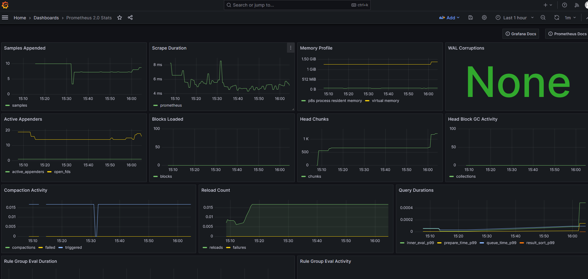
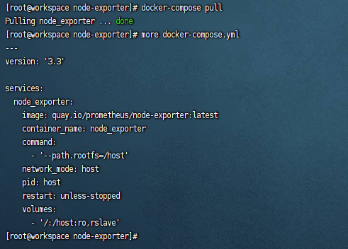
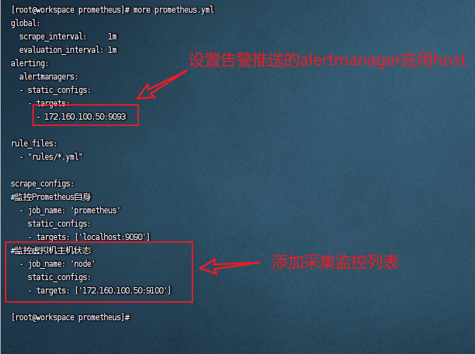

# 服务器及相关组件监控

> 本文档主要记录了常用企业级服务器及各种组件的监控手段和监控部署方案，使企业可以实时感知服务器组件的健康状态，并在服务器或组件出现异常时及时做出反应。
>
> 本方案采用的Prometheus+grafana的方式实现对服务器及各种组件的监控，以下内容将会带你从零开始，一步步搭建整个监控方案。监控对象包括：服务器监控（cpu、内存、磁盘等指标）、mysql监控、redis监控、kafka监控、clickhouse监控、docker容器等常用组件的监控。
>
> 为便于维护，本方案几乎所有用到的组件均采用docker进行部署，需要服务器上安装部署好了docker环境，包括`docker`和`docker-compose`。

## 基础环境安装部署

>
基础环境总共包含`Prometheus`、`alertmanager`和`grafana`三个组件，其中，`Prometheus`组件主要用于采集各监控对象的各项指标，并将其入库（`Prometheus`本身就是一个数据库），`alertmanager`作为`Prometheus`组件的一个补充模块，负责接收来自`Prometheus`组件的阈值告警信息，并将其状态推送到指定的告警组件，包括但不限于`邮件`、`webhook告警`等，而`grafana`作为一个展示界面，可以非常灵活的展示各个指标的相关参数数据，包括但不限于各种趋势图、饼图等。
>
> <br>
>
> 下面我将给大家展示这3个组件搭建部署方法，以及使用方法。

### Prometheus安装部署

`Prometheus`官方有对应的docker镜像，通过docker镜像进行部署，不仅部署起来方便，还会使系统整体上更加整洁，便于后期的维护。直接拉去对应的镜像，并将其封装打包用`docker-compose`进行维护即可。具体操作如下：

1. 官网获取最新Prometheus相关版本，访问[Prometheus官网](https://prometheus.io/download/)，点击跳转到[docker界面](https://hub.docker.com/u/prom)获取下载链接
<br>
<br>
进入界面，得到当前最新版本镜像，如下图：<br>
<br>


2. 服务器直接拉去该镜像即可
```shell
docker pull prom/prometheus:v2.47.2
```
<br>

3. 创建Prometheus应用目录和相关配置文件

>
在安装目录下创建`prometheus`目录，并且在目录中创建启动文件`docker-compose.yml`和配置文件`prometheus.yml`，另外创建`prometheus_data`目录用于外挂到启动容器，以便Prometheus数据本地落盘.
    ```shell
    mkdir prometheus
    cd prometheus
    touch docker-compose.yml prometheus.yml
    mkdir -m 777 prometheus_data
    ```
    <br>


`docker-compose.yml`文件内容如下：
```yaml
version: '2.4'
services:
  prometheus:
    image: prom/prometheus:v2.47.2
    container_name: prometheus
    hostname: prometheus
    restart: always
    volumes:
      - ./prometheus.yml:/etc/prometheus/prometheus.yml
      - ./prometheus_data:/prometheus
    ports:
      - "9090:9090"
    cpus: 4
```

`prometheus.yml`文件内容如下：

```yml
global:
  scrape_interval:     1m
  evaluation_interval: 1m
alerting:
  alertmanagers:
  - static_configs:
    - targets:
      #- 255.255.255.255:9093

rule_files:
  - "rules/*.yml"

scrape_configs:
#监控Prometheus自身
  - job_name: 'prometheus'
    static_configs:
    - targets: ['localhost:9090']
```

4. 启动应用并验证

```shell
docker-compose up -d
```

浏览器访问服务器`9090`端口若页面可以正常加载，表明安装成功
<br>


5. 停止应用并封装

```shell
docker-compose down
docker save prom/prometheus:v2.47.2 | gzip > prometheus.image.tgz
```

<br>
封装完成后，直接将整个Prometheus目录拷贝到生产环境启动即可。

>
启动命令如下：
    ```shell
    docker load -i prometheus.image.tgz
    docker-compose up -d
    ```

### alertmanager安装部署

同样的方法，从[docker界面](https://hub.docker.com/u/prom)点击可以看到alertmanager最新的版本镜像

<br>
<br>
<br>

直接拉取最新镜像即可实现

```shell
docker pull prom/alertmanager:v0.26.0
```

<br>

创建`alertmanager.yml`文件，内容设置告警模式为`webhook`并指定告警url，内容如下：
```yml
global:
  resolve_timeout: 5m

route:
  group_by: ['alertname']
  group_wait: 10s
  group_interval: 10s
  repeat_interval: 1h
  receiver: 'webhook'
receivers:
  - name: 'webhook'
    webhook_configs:
      - url: 'http://<告警url>'

inhibit_rules:
  - source_match:
      severity: 'critical'
    target_match:
      severity: 'warning'
    equal: ['alertname', 'dev', 'instance']

```

修改`docker-compose.yml`文件，添加`alertmanager`应用启动信息，具体如下：
```yml
version: '2.4'
services:
  prometheus:
    image: prom/prometheus:v2.47.2
    container_name: prometheus
    hostname: prometheus
    restart: always
    volumes:
      - ./prometheus.yml:/etc/prometheus/prometheus.yml
      - ./prometheus_data:/prometheus
    ports:
      - "9090:9090"
    cpus: 4

  alertmanager:
    image: prom/alertmanager:v0.26.0
    container_name: prom_alertmanager
    hostname: alertmanager
    restart: always
    depends_on:
      - prometheus
    ports:
      - "9093:9093"
    volumes:
      - ./alertmanager.yml:/etc/alertmanager/alertmanager.yml
      - ./alertmanager:/alertmanager

```

启动应用
```shell
docker-compose down && docker-compose up -d
```
<br>

浏览器访问`alertmanager`应用首页


### grafana安装部署

grafana组件作为可视化工具，提供了丰富的可视化界面，同时还有丰富的开源社区，可以下载到很多优质的可视化panel，极大的方便了系统运维人员。

为方便后期运维，grafana的安装方法同样采用docker进行安装，具体步骤如下：

1. 获取最新镜像并拉取，访问docker官方仓库，搜索grafana，复制最新镜像并从服务器上拉取
<br>
<br>
<br>
拉取镜像
```shell
docker pull grafana/grafana:10.2.0
```
<br>

2. 创建应用目录并配置应用启动文件

```shell
mkdir grafana
cd grafana
mkdir data
touch docker-compose.yml
```
<br>

`docker-compose.yml`文件内容如下：

```yml
version: '3'
services:
  app:
    image: "grafana/grafana:10.2.0"
    user: "root"
    network_mode: "host"
    restart: always
    volumes:
      - ./data:/var/lib/grafana
```

3. 启动应用并访问首页

```shell
docker-compose up -d
```

<br>
<br>

> grafana默认账号密码： `admin/admin`，登录后可以选择跳过不修改密码。

4. 将Prometheus数据源导入grafana

<br>
<br>
<br>
<br>

5. 导入相关监控模板

<br>
<br>
<br>
<br>


_至此，服务器组件监控的基础环境搭建完成。_

## 服务器监控

服务器监控需要安装部署`node-exporter`组件，可以直接本地部署，也可以通过容器进行部署，推荐使用容器进行部署。

1. 从[官网](https://prometheus.io/download/)上下载`node-exporter`应用的镜像包，直接通过`docker-compose`进行启动。
<br>
<br>
<br>

2. 创建应用并配置`docker-compose.yml`启动文件
<br>

3. 拉取镜像并启动应用

_拉取镜像_
```shell
docker-compose pull
```
拉取镜像前，需要`quay.io`添加到docker服务器的配置文件的`insecure-registries`参数中，否则会拉取失败
<br>


_启动应用_
```shell
docker-compose up -d
```
<br>

4. 配置Prometheus采集策略，修改`prometheus.yml`文件，将对应node的api端口添加到配置文件中并重启应用

>
通过`docker inspect <容器id>`可以查看容器监听端口
<br>
<br>

`prometheus.yml`配置文件中添加配置：
```yml
#监控虚拟机主机状态
  - job_name: 'node'
    static_configs:
    - targets: ['<服务器ip>:9100']
```
<br>

5. 重启Prometheus

```shell
docker-compose down && docker-compose up -d
```
<br>

6. Prometheus查看采集数据

<br>
至此，表明数据已经在正常采集

7. 将对应告警策略rules添加到Prometheus，使得当服务器出现故障时，Prometheus自动触发相关告警

添加`prometheus_rules`目录用于存放所有rules文件
```shell
mkdir prometheus_rules
```
添加`prometheus_rules/nodes.yml`文件，文件内容如下：
```yml
groups:
  - name: 服务器自监控
    rules:
      - alert: 服务器状态
        expr: up{job='node'} == 0
        for: 60s
        labels:
          severity: error
        annotations:
          summary: '【服务器故障】导致无法正常访问时，服务器可能已经出现宕机，需要立即处理！！！'
          description: '当前节点：{{ $labels.instance }} ' 

      - alert: 服务器CPU使用率
        expr: round((1 - avg(rate(node_cpu_seconds_total{mode='idle'}[2m])) by (instance))*100, 0.01) > 85
        for: 300s
        labels:
          severity: error
        annotations:
          summary: '【服务器】CPU使用率大于85%，需要立即关注！！！' 
          description: '当前节点：{{ $labels.instance }}，当前值{{ $value }}% '


      - alert: 服务器内存使用率
        expr: round(((node_memory_MemTotal_bytes{job="node"} - node_memory_MemAvailable_bytes{job="node"} )/node_memory_MemTotal_bytes{job="node"})*100, 0.01) > 85
        for: 300s
        labels:
          severity: error
        annotations:
          summary: '【服务器】内存使用率大于85%，需要立即关注！！！' 
          description: '当前节点：{{ $labels.instance }}，当前值{{ $value }}% '

      - alert: 服务器磁盘使用率
        expr: round(((node_filesystem_size_bytes{mountpoint="/opt"} - node_filesystem_free_bytes{mountpoint="/opt"}) / node_filesystem_size_bytes{mountpoint="/opt"}) * 100, 0.01) > 85
        for: 60s 
        labels:
          severity: error
        annotations:
          summary: '【服务器】数据盘使用率大于85%，需要立即关注！！！' 
          description: '当前节点：{{ $labels.instance }}，数据盘挂载： {{ $labels.mountpoint }}；当前值{{ $value }}% '

      - alert: 服务器进程数
        expr: node_procs_running > 800
        for: 60s 
        labels:
          severity: error
        annotations:
          summary: '【服务器】当前进程数大于800，需要立即关注！！！' 
          description: '当前节点：{{ $labels.instance }}；当前值{{ $value }} '

      - alert: 服务器文件句柄数
        expr: round(node_filefd_allocated / node_filefd_maximum * 100, 0.01) > 10
        for: 60s 
        labels:
          severity: error
        annotations:
          summary: '【服务器】句柄数使用率超过10%，请及时关注！！！' 
          description: '当前节点：{{ $labels.instance }}；当前值{{ $value }}% '
```
修改`docker-compose.yml`启动文件，将`prometheus_rules`挂载到容器中
<br>

8. 重启Prometheus

```shell
docker-compose down && docker-compose up -d
```
<br>

9. Prometheus页面查看rules规则
<br>
可以看到部分异常指标已经被监控并且告警出来，通过webhook应用（一般定制实现，本应用有flask实现，非官方组件，由个人开发，仅供测试使用）后台的log发现告警信息已经推送至对应的webhook应用。
<br>
<br>

10. 登录[grafana官网](https://grafana.com/grafana/dashboards/)，下载node对应监控dashboard文件并配置相关数据源

搜索dashboard
<br>

下载导入dashboard

<br>
<br>
<br>
<br>
**至此，服务器组件监控到此结束，更多玩法可以自行到官方查阅文档**

## 其他组件监控

>
其他组件的监控可以与`服务器监控类型`可以到`prometheus`官网下载并配置对应`exporter`组件，将其配置到Prometheus的采集列表中（修改`prometheus.yml`文件），配置Prometheus告警阈值rules（添加prometheus_rules文件）后方可实现对相关组件的监控。


